  

- 🌱 I’m currently focused on learning back-end development, Go, C, C++
- 🌱 Incoming SWE Intern @ FanDuel
- 🌱 M.S. Computer Science @ Georgia Tech
- 🌱 B.S. Statistics & Data Science Alum @ UC Santa Barbara

- 📫 How to reach me: **sjaipuriyar6@gatech.edu** or **smyanj5000@gmail.com**

<h3 align="left">Connect with me:</h3>

